<center></center>

Update: August 9th, 2017

# Lab 100 - Integration Cloud Service

---

## Objectives

- Using Integration Cloud Service (ICS) to create an API to be consumed by APIPCS.

## Required Artifacts

- The following lab and an Oracle Public Cloud account that will be supplied by your instructor.

## Introduction

This is the first of several labs that are part of the **APIPCS/ICS Integration Workshop** workshop. 

In this lab, we will create a generic API, in Integration Cloud Service (ICS) to be consumed by the API Platform Cloud Service (APIPCS).  You will acquire a good overview of the Oracle Integration Cloud Service (ICS), the next generation integration platform. You will explore various consoles and tools available to interact with your integration. This lab will get you familiar with all the tooling available to work with this cloud service. 

We’ll look at the following:
1.	Creating an ICS REST Connection
2.	Creating an ICS Orchestration Integration Flow
3.	Exposing the Integration as generic REST API

The ICS integration that we'll be working with, is REST service that is shown in the following picture:


Here is a description of what is happening with this integration:

POSTMAN will be used to test the exposed REST Service endpoint of the ICS integration called *HelloWorld*.  This integration has no connections, and only echoes a response.  The incoming message is received by the incoming *helloWorldREST* REST Connection.  The *HelloWorld* orchestration concatenates a `Hello, ` to the `request` and returns a `Hello, request`. It also returns a `customHeader` in the payload of the response, for ease of debugging.

Let’s start by logging into the Oracle Cloud account and explore the Services Dashboard

## 1.1: Explore the Oracle Cloud Dashboard

### **1.1.1**: Login to your Oracle Cloud Account

---

- From your browser (Firefox or Chrome recommended) go to the following URL:
<https://cloud.oracle.com>
- Click Sign In in the upper right hand corner of the browser
- **IMPORTANT** - Under My Services, change Data Center to `US Commercial 2 (us2)` and click on Sign In to My Services

    

- If your identity domain is not already set, enter it and click **Go**

    **NOTE:** the **Identity Domain** values will be given to you from your instructor.

      

- Once your Identity Domain is set, enter your `User Name` and `Password` and click **Sign In**

    ***NOTE:*** the **User Name and Password** values will be given to you by your instructor.

    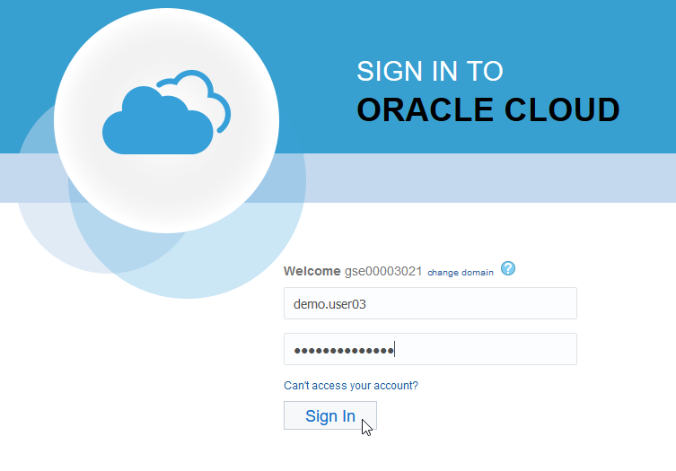  

- You will be presented with a Dashboard displaying the various cloud services available to this account.

   **NOTE:** The Cloud Services dashboard is intended to be used by the *Cloud Administrator* user role.  The Cloud Administrator is responsible for adding users, service instances, and monitoring usage of the Oracle cloud service account.  Developers and Operations roles will go directly to the service console link, not through the service dashboard.

    

### **1.1.2:**	Explore Oracle Cloud Dashboard

---

The Cloud Dashboard is the launching pad for all the cloud services in your account. You have access to the following Cloud service: **Oracle Integration Cloud Service, Oracle Process Cloud Service, Oracle Database Cloud Service, Oracle Database Backup Service, Oracle Storage Cloud Service, Oracle Compute Cloud Service, Oracle Java Cloud Service and Oracle SOA Cloud Service**. The dashboard can be customized by selecting the `Customize Dashboard` button.

- To look at the details for the Integration Cloud Service (ICS) instance, first click on the `hamburger` icon, then click on the `View Details` link.

   

- The `Service Details` pages will show various important details about the ICS service instances in this identity domain such as service start date, end date, and your Oracle Cloud subscription ID.

   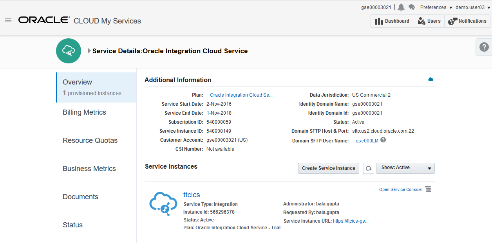

- Access to `Billing Metrics`, `Resource Quotas`, etc.  can be found in the left-hand navigation.  Select the `Business Metrics` tab as shown below:

   

- The `Business Metrics` page will show the total number of messages that ICS has processed and the total number of active connections currently in the subscription.

   

- After getting familiar with the Business Metrics, go back to the “Overview” tab and select the `Open Service Console` link to go to the ICS Service Console.  

      

- You will now be presented with the ICS Welcome Page

      

## 1.2: Connections

### **1.2.1:**	Open the ICS Connections Page

---

- **Click** on the `Connections` icon on welcome page of ICS to navigate to open the Connections page.

      

- You will be presented with the ICS Connections Page:

    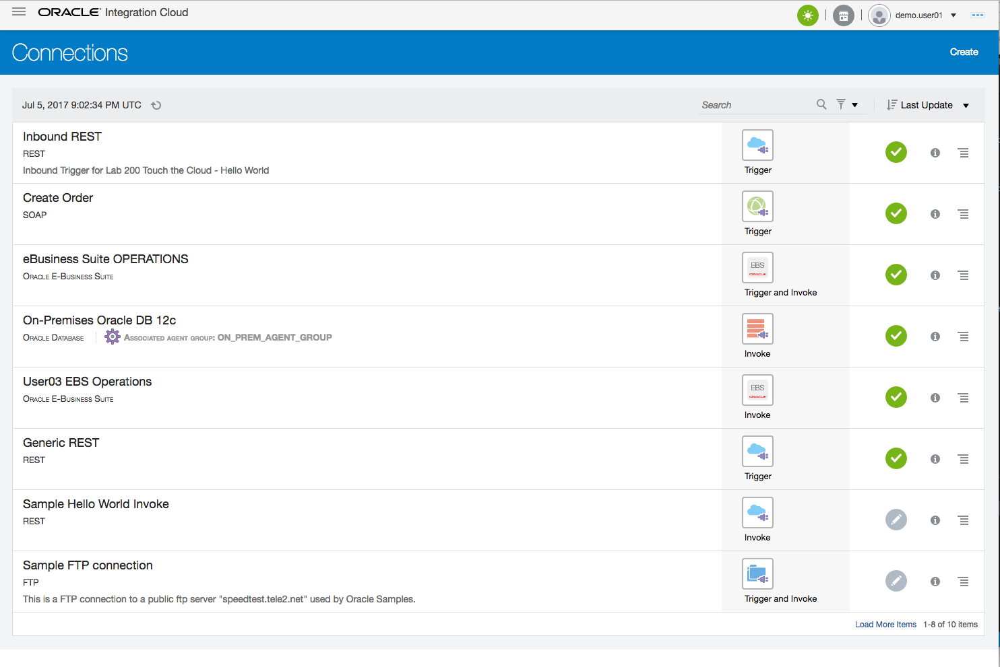  

### **1.2.2:**	Generic REST Adapter

---

> For our workshop we are going to re-use an already configured connection called 'Generic REST', since it is a trigger event, all the detailed configuration will be implemented in the actual integration. The defined `Generic REST` connection is just a template to be used in the integration.

- **Click** on the `Generic REST` adapter to open up the configuration page

    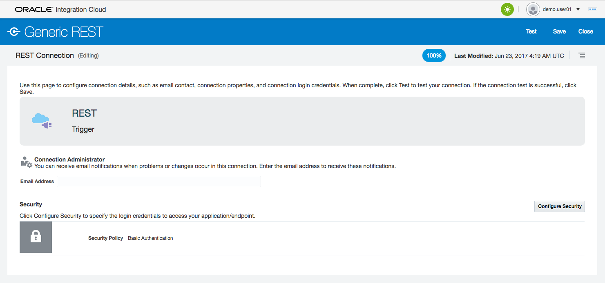

As you can see that there is not much you can configure, apart from the owner's email address. The `Security Policy` can be changed, but the REST Adapter only supports `Basic Authentication` when used as a trigger.

- **Click** on `Close` to return to the Connections Page

## 1.3: Integrations

### **1.3.1** Open the ICS Integrations Page

---

- **Click** on the Hamburger menu, next to `Oracle Integration Cloud` to see the possible navigation from the current page.

    

- **Click** `Integrations` on the Menu to open the Integrations Page

    

### **1.3.2** Creating an Integration

---

- **Click** on the `Create` to create a new Integration

    

- On the popup window, `Select` **Orchestration**

    

- In the `Create Integration` window fill in the following:

    - Select `Application Event or Business Object`
    - Call you integration `Helloworld_UserXX`, where UserXX is your allocated username.

- Then **Click** `Create`

    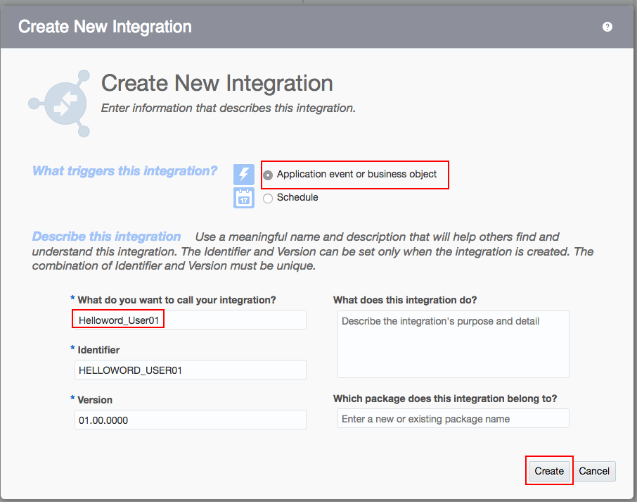

- You will be greeted with a page confirming the creation of your `Helloworld_UserXX` integration.

    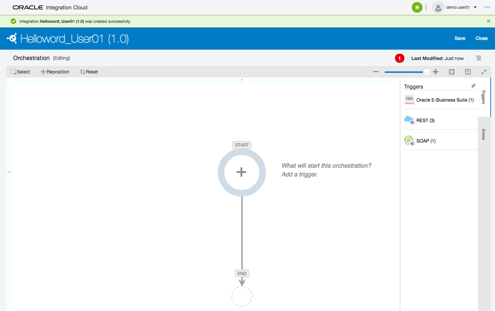

> The red `1` next to `Last Modified`, is an indicator of the amount of errors, which will disappear as we supply the configuration in the following steps


### **1.3.3** Configuring REST Trigger

---

- Expand the REST Connections, and drag `Generic REST` on the start trigger.

    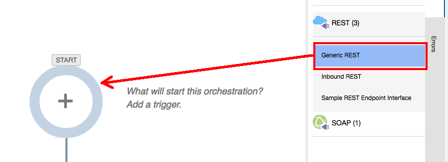

- In the popup window, supply the following values:
    - Name of endpoint `helloWorld`
    - Endpoint relative rource URI `/helloworld_userXX` (Where userXX is your allocated username)
    - Change the action `POST`
    - **Select** Checkbox to configure `Configure a request payload for this endpoint`
    - **Select** Checkbox to configure `Configure this endpoint to receive the response`
    - **Select** `Custom` Checkbox for `Configure Request Headers`
    - **Select** `Custom` Checkbox for `Configure Response Headers`
    - **Select** Checkbox for `Configure CORS (Cross Origin Resource Sharing)`


    

- **Click** on `Next`

- On the `Configure the Request Payload` wizard page
    - Select `JSON Sample` under `Select request payload file`
    - Select `JSON` under `Select the type of payload ...`

    

- **Click** on the **`<<< inline >>>`** link to open the `Request Sample Json Payload` wizard

- Supply the following JSON:

    ```javascript
    {
        "greetings":"user01"
    }
    ```

    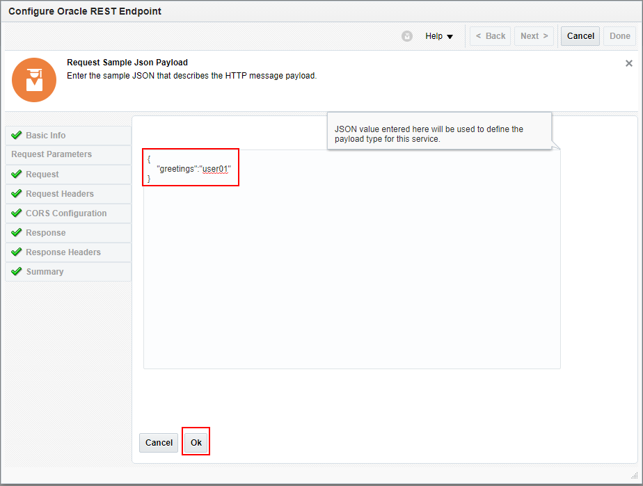

- **Click** `OK` to return to `Configure the Request Payload` wizard

- **Click** on `Next >` to move to the `Request Header` step 

- On the `Request Header` we are going to add a `customHeader` which we are going to populate from APIPCS.
    - Add a header, called `icsHeader` and give it a description `APIPCS supplied value`

    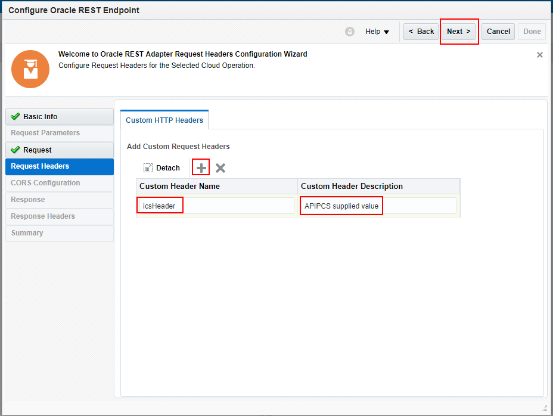

- **Click** on `Next >` to move to the `Configure CORS for the inbound service` step

- On `Configure CORS for the inbound service` page, Enable CORS for all domains, by entering * in `Allowed Origins`

    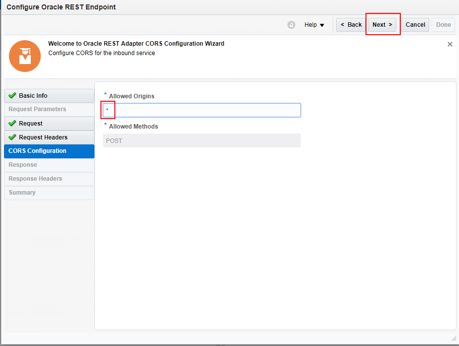

- **Click** on `Next >` to move to the `Configure the Response Payload` step

- On the `Configure the Response Payload` page, we are going to define the response messgae
- On the `Configure the Response Payload` wizard page
    - Select `JSON Sample` under `Select response payload file`
    - Select `JSON` under `Select the type of payload ...`

    

- **Click** on the **`<<< inline >>>`** link to open the `Response Sample Json Payload` wizard

- Supply the following JSON:

    ```javascript
    {
        "greetings":"Hello user01",
        "customHeaderDebug":"Value passed in from APICS"
    }
    ```

    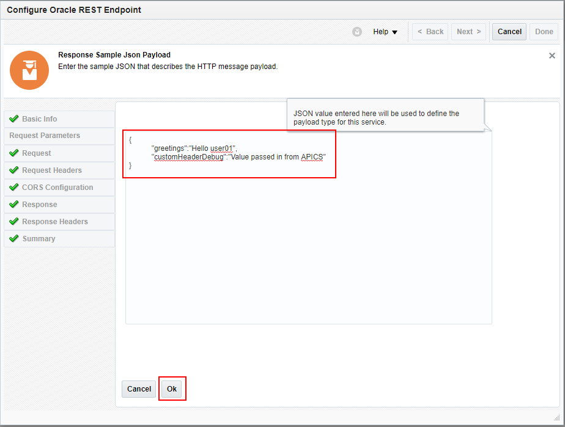

- **Click** `OK` to return to `Configure the Response Payload` wizard

- **Click** on `Next >` to move to `Response Headers Configuration` Wizard

- Add a header for our response `icsHeader`

    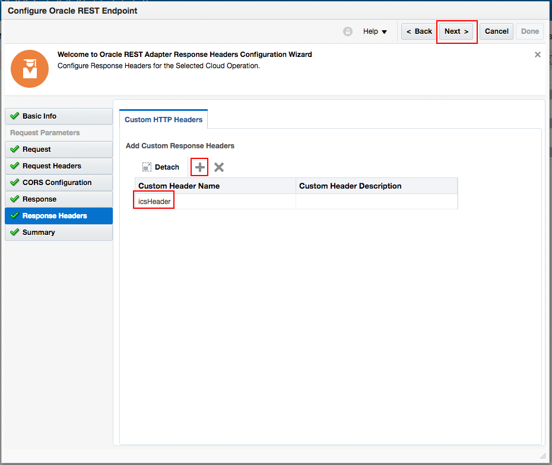

- **Click** on `Next >` to move to the `Summary` page

    

- **Click** on `Done` to complete the configuration of the REST Endpoint

- You should be greeted by a similar page:

    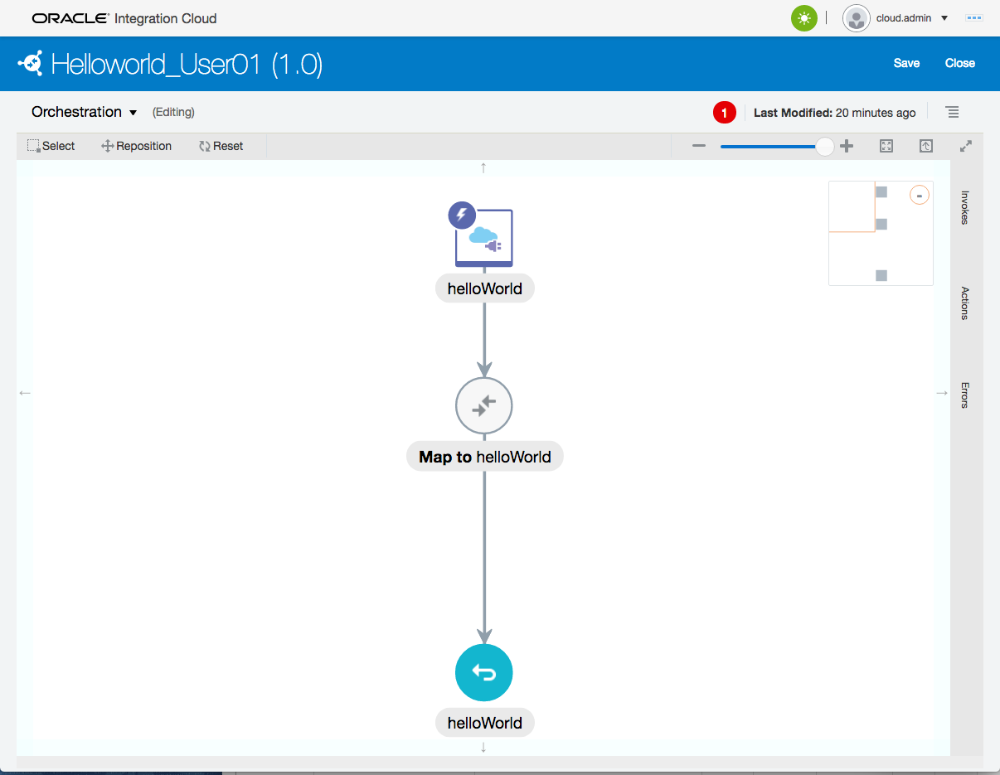

### **1.3.4** Configuring Mapping

---

The next step is to configure the mapping, ie. matching the input to the output of the `HelloWorld` call.

- **Click** on the map and then **click** on the `pencil` icon to edit mapping

    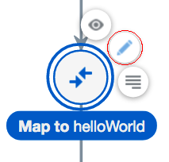

- Do the mapping by dragging the ` greeting` field on the left hand side to the `greeting` field on the right hand side, as illustrated by the following picture:

    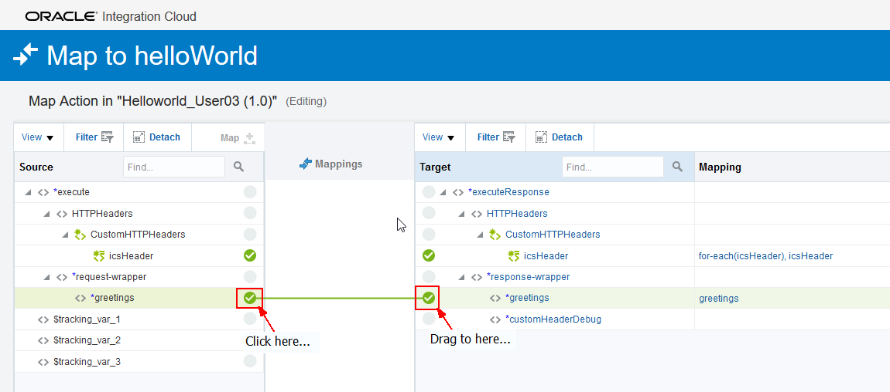

- Next step is to extend the `icsHeader` mapping to include a marker that the header was changed by ICS.

    - On the target side click on `icsHeader`

        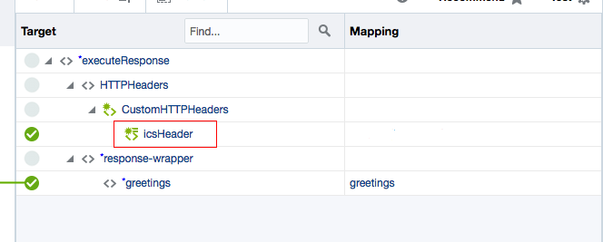

    You will see the following screen:

    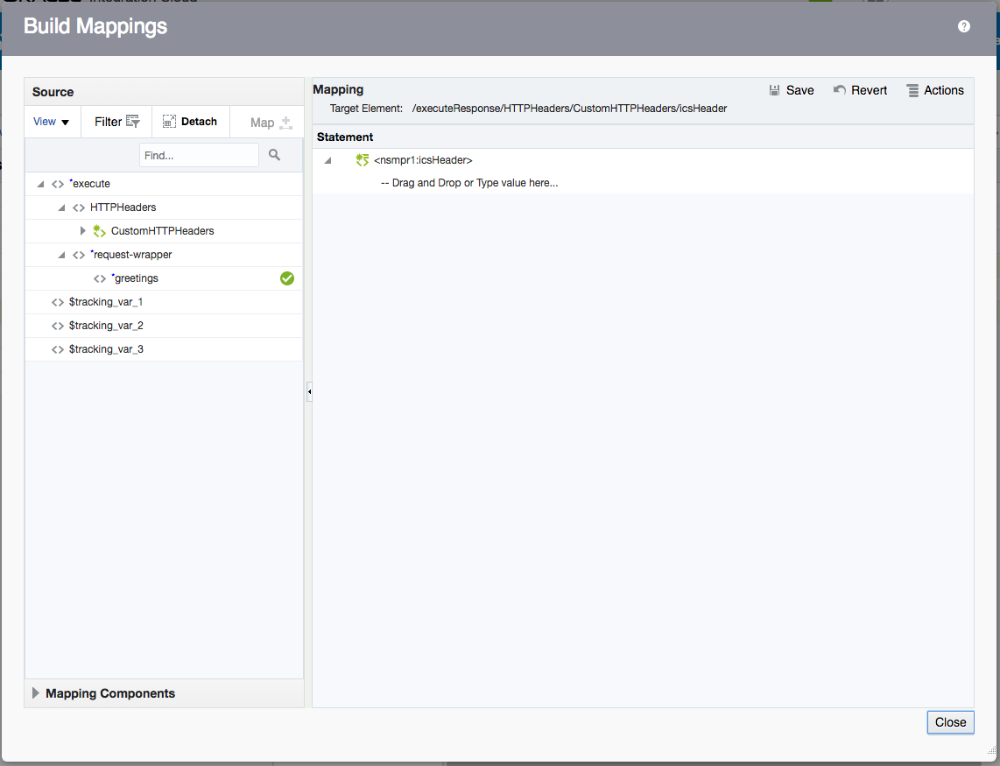

    - Expand the `Mapping Components` on the `Source`, expand `Functions`, `String` and drag the `fx concat` to `-- Drag and Drop or Type value here...`

        

        - Replace `string2` with `"- ICS"`, by clicking on the field and changing the value
        - Replace `string1` with `icsHeader`, by selecting the field from the source panel

        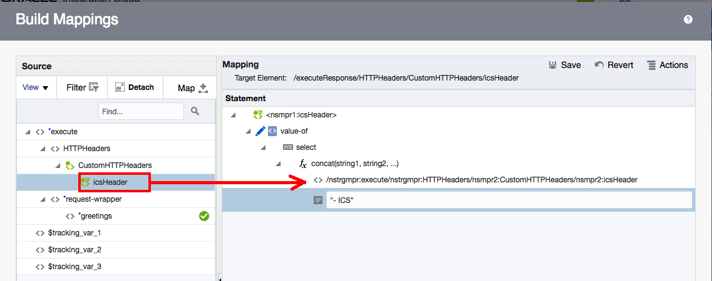

    - **Click** on `Save` to save the mapping

        

    - **Click** on `Close` and `Apply` the `Map Action`

        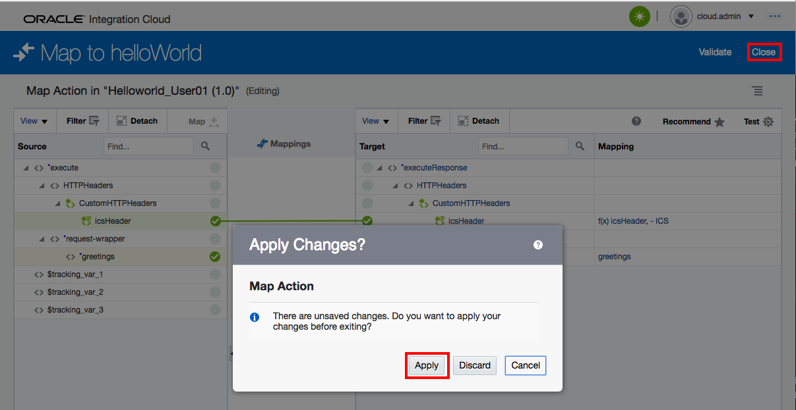

### **1.3.5** Configuring Tracking

---

Configure tracking fields for the orchestration so that we can use business identifiers for tracking messages with ICS `Monitoring` tools.

- Back in the orchestration editor, **Click** on the `hamburger` menu on the right hand-side, and select `Tracking`

    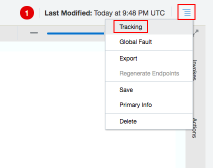

- Drag and drop `greetings` to `Primary Tracking Field`

    

- **Click** `Done` to complete tracking

- **Click** on `Save` to close the `Orchestration Editor`


### **1.3.6** Activating Integration

---

Back on the `Integrations` page, we are now going to activate and publish our `HelloWorld` integrations

- **Click** on your Inegration's context menu in the right hand side of your integration, and **click** on `Activate`:

    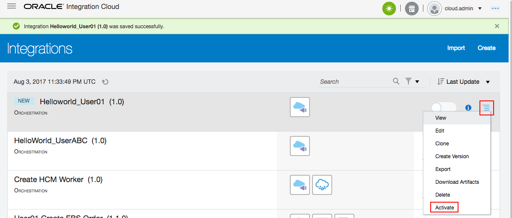

- Make sure to select `Enable Tracing`, `Include payload` and click on `Activate`

    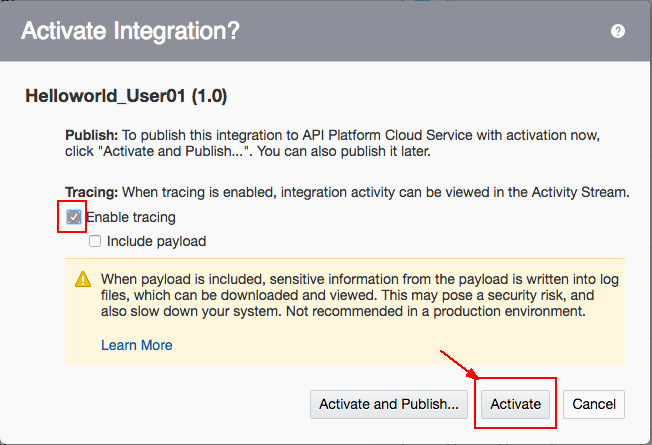

- After a short period, HelloWorldUserXX will be activated and  successful message is displayed

    

- Copy the URL from the page above https://<ICS URL>/integration/flowapi/rest/HELLOWORLD_USER01/v01/metadata, paste it into a browser to check if HelloWorldUserXX Integration Flow is working.
    - NOTE: The first time you make the call within a Browser to the Integration, you will be prompted to enter your credentials and click Log In

    

- The Browser window will display HelloWorldUserXX metadata information

    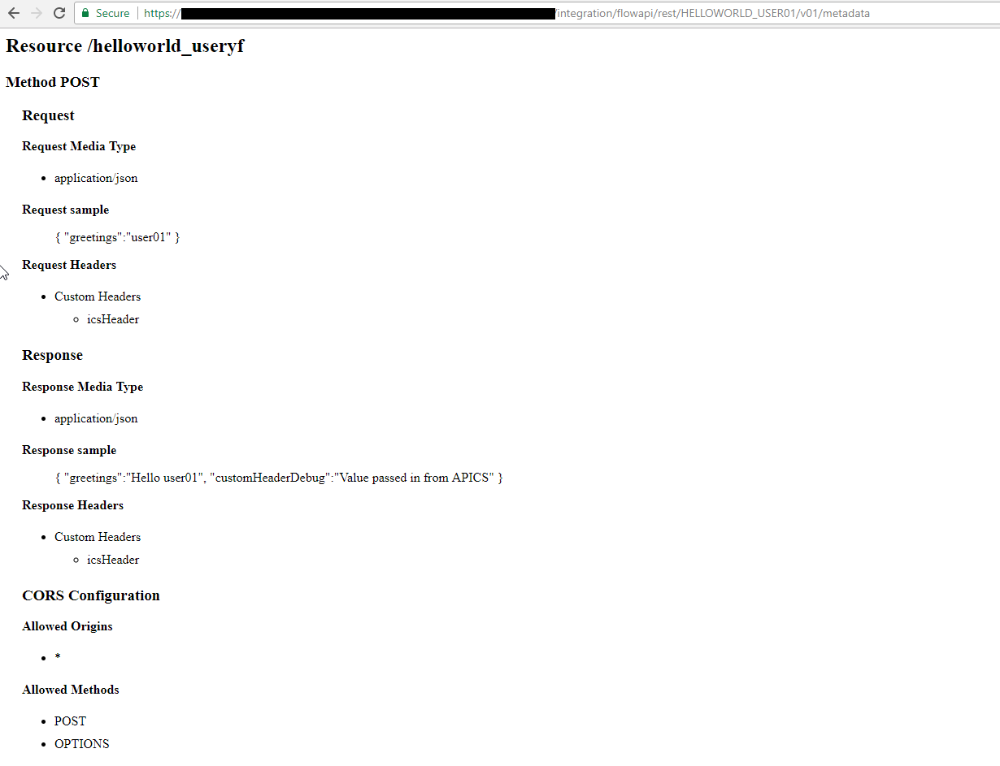

- Oracle ICS supports Swagger definition of the Integration. To display the Swagger definition, add `/swagger` to the URL - https://<ICS URL>/integration/flowapi/rest/HELLOWORLD_USER01/v01/metadata/swagger

    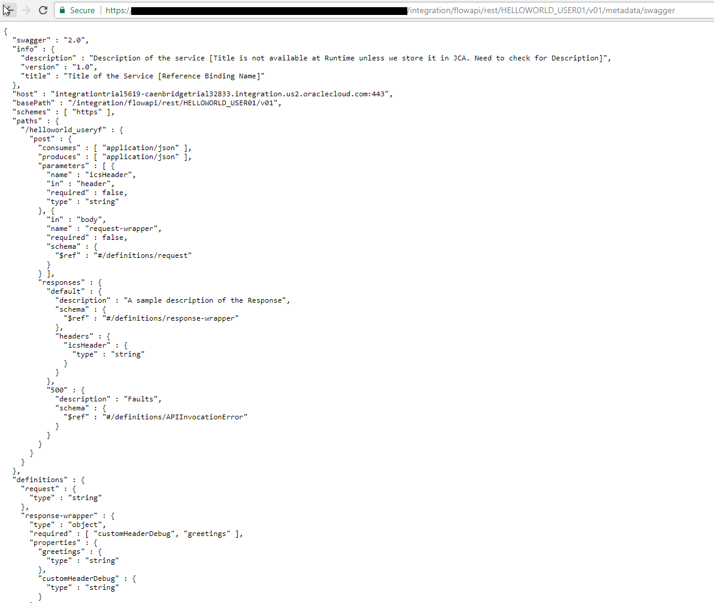


## Completion of LAB 100
