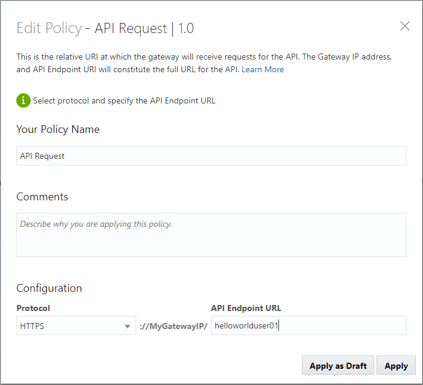
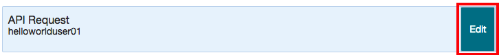
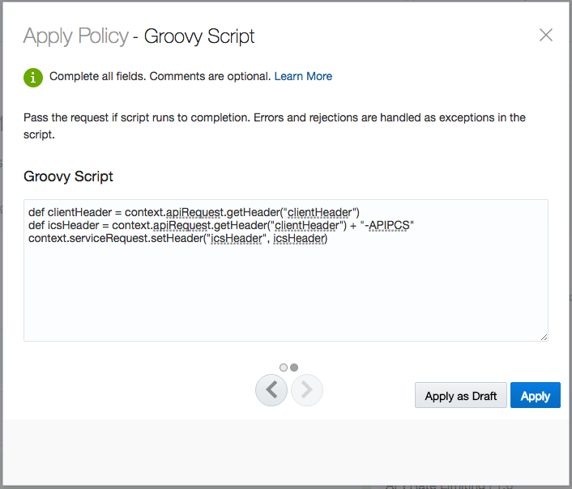
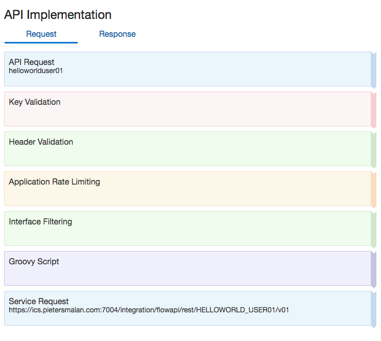

<center></center>

# Lab 200 - API Platfrom Cloud Service

## Objectives

- Using API Platform Cloud Service (APIPCS) to add Policies to manage, secure and govern HelloWorld API.

## Required Artifacts

- The following lab and an Oracle Public Cloud account that will be supplied by your instructor.
- Deployment of ICS REST service in Lab 100

## Introduction

This is the second of several labs that are part of the **APIPCS/ICS Development Workshop**. 

In this lab, we will learn how to expose our ICS REST service, created in Lab 100, through the API Platform Cloud Service, enforce policies and share the documentation around our controlled service to developers.

We’ll look at the following:
1.  Apply Policies to API
2.  Publish API to gateway
3.  Testing Applied Policies

## Login to your Oracle Cloud account

### Login to APIPCS Home Page

>***NOTE:*** the **User Name** and **Password** values will be given to you by your instructor. See _Lab 100 **1.1.1**: Login to your Oracle Cloud Account_ for more information on how to sign into the APIPCS home page.


  

Sign in to the Management Portal as a user with the API Manager role:

 

---

## 1. API Platform Cloud - Management Portal
---


### 1.1 APIs

#### 1.1.1 Create an API Proxy

- Now you’ll create a proxy for your API.

- To create an API:
  - From the APIs tab, click Create API.
  - Enter the name of your resource followed by your assigned number (like HelloWorldUserXX) into the API Name field. This makes it easier to identity your API in case multiple people use the same API name.
  - Enter 1 in the Version field.
  - (Optional) Populate the description field in this form as you would like.

 

  - Click Create.

 

#### 1.1.2 Configure the API Request

- The API request is the endpoint to which requests for your API are sent when it is deployed to a gateway.

- To configure the API Request:
  - From the APIs page, click the API you created in the previous task.
  - Hover over the API Request policy, and then click Edit.

   

>***NOTE:***Note: If the Apply Policy Dialog does not appear, disable any pop-up blockers that are active and try again.

 

- On the Apply Policy Dialog, complete these fields:
  -Select HTTPS from the Protocol list. This is the protocol on which the gateway receives requests for this API.
  - Enter name of your resource in lower case, followed by your assigned number to ensure uniqueness (like helloworlduserXX) into the API Endpoint URL field.

 

  - Click Apply.

#### 1.1.3 Configure the Service Request

- The service request is the URL at which your backend service receives requests. When a request meets all policy conditions, the gateway routes the request to this URL and calls your service.

- The service request URL can point to any of your service’s resources, not just its base URL. This way you can restrict users to access only a subset of your API’s resources.

- To configure the service request:
  - Hover over the Service Request policy, and then click Edit.

 

  - On the Apply Policy Dialog, complete these fields:
    - Paste the mock server value you copied at the end of Lab 100 (which should resemble 
  https://<ICS URL>/integration/flowapi/rest/HELLOWORLD_USER01/v01/helloworld_user01) into the Backend Service URL field.
    - Add the Service Account which stores the credentials to log into Oracle ICS

 

    - Click Apply.

 

    - Click Save Changes

#### 1.1.4 Deploy API to the API Gateway

After creating the API, adding the API Request and Service Request. In this section you will deploy the API to and API Gateway so that it receives requests at the endpoint you configured and routes successful requests to the service you created with Oracle ICS in Lab 100. 

- To deploy the API:
    - Click the Deployments tab.


  - Click Deploy API. You will see a list of Deployment Gateways available with APIPCS


  - Select the `Production Gateway - NA- Oracle` Gateway.
  - Select Active as the Initial Deployment State.
  - (Optional) Complete the description field in as you like.


  - Click Deploy.
  - Wait for the deployment to complete (the page refreshes automatically). The deployment is complete when your API displays on the Deployed tab.


  

  - Copy the URL that appears in the Load Balancer URL section. This is the endpoint clients use to send requests to your proxy API on the gateway. 

    - The URL should look something like this: http://oc-129-144-152-17.compute.oraclecloud.com:9022/helloworlduser01
  


#### 1.1.4 Test API


On the APIs page you have the capability to create new API, edit or look at existing APIs. Let us explore our published ICS REST Service.

  

- **Click** on your `HelloWorldUserXX` API to drill down into the details

  

#### 1.1.1 API Implementation detail
---

Let's start with the implementation of our service:

- Let's confirm our `API Endpoint URL`, **click** on the `Edit` button, when hovering over the `API Request` policy box

  

- Confirm that the `API Endpoint URL` is set to `helloworlduserXX`

  

- Leaving the rest of fields on the defaults, and **click** `Apply`

- Next we are going to inspect the `Service Request`, **click** on the `Edit` button, when hovering over the `Service Request` policy box

  

  We have to specify the service account information for the call, in other words, the authentication for the ICS REST service. Select the predefined `ICS` service account and **click** `Apply`.

  

### 1.1.2 Policy Pipeline
---

#### 1.1.2.1 Key Validation

- On the right hand side, under `Available Policies`, select `Key validation 1.0` and `Apply`

  

- **Click** on the `>` icon to go to the next page, we don't need any changes on this page.

  

- On the second page of the `Apply Policy - Key Validation`, make sure to select the `Header` button and then specify `api-key` as the `Key Header`
  - We specified in this policy that a HTTP Header with name `api-key` should be in the request, set to a valid API Key. When we associate the API with an application, we will have    access to the api key as defined in the application.
  
  

- After **click** apply we a policy pipline as follow:

  

---

> Using the same steps as above, add the following policies.

---

#### 1.1.2.2 Application Rate Limiting

- Under `Available Policies` -> `Traffic Mangement` add `Application Rate Limiting | 1.0`

  

  

  

#### 1.1.2.3 Header Validation

- Under `Available Policies` -> `Interface Mangement` add `Header Validation | 1.0`

  

  

  

#### 1.1.2.4 Interface Filtering

- Under `Available Policies` -> `Interface Mangement` add `Interface Filtering | 1.0`

  

  

  

#### 1.1.2.5 Groovy Scripting

- Under `Available Policies` -> `Other` add `Groovy Script | 1.0`

  

  - Add the following 3 lines in the `Groovy Script` 


  ```groovy
    def clientHeader = context.apiRequest.getHeader("clientHeader")
    def icsHeader = context.apiRequest.getHeader("clientHeader") + "-APIPCS"
    context.serviceRequest.setHeader("icsHeader", icsHeader)
  ```

  

  

----

Apply the changes, by **clicking** the `Save Changes`

  

---

### 1.3 Deployment

- The next step is to deploy the API. **Click** on the `Deployments` icon, then **click** on `Deploy API`

  

- Select the target `Development Gateway` and **click** on `Deploy`

  

  

> It takes about a minute to deploy. Be patient.

  

  ### 1.4 Publication

  In the publication we are going to add some information for developers.

  - **Click** on the `Publish` icon

    

  - **Click** on the `Developer Portal API Overview` `Markdown` button

    Enter the following text, adopting it to your own API name:

```javascript
---
Welcome to my *Hello World API*
---
```

  

  - **Click** on `Documentation` `Markdown` and supply the following text:

``` 
This is an echo service hosted by ICS. 

The following headers are required:
---
api-key with a valid Application Key
clientHeader with an identifier (used to track flow through ICS)
---
Method: POST
---
Sample Payload:
{
  "greetings" : "Jack"
}
---
```

  

> This documentation will be replaced by the *Apiary* in a later lab

And the last steps are to `Save Changes` and then `Republish` the new documentation to the **Developer Portal** 

  

> If you are really curious to see the Developer's Portal - you can click on `Preview`, to open the developer's API Portal.

### 1.5 Registrations

Remember the test for a valid API Key ?  This is the place were we define the relationship between APIs and Applications.

- **Click** on Registrations

  

- Select `Hello World Application` and click on `Register`

  

  

---
  ### 1.2 Applications
---

> We are not going to create applications, but we need to capture the API key.

Open the `Applications` page

  

- **Click** on the `Hello World Application`, make a note of the `App Key` (or use the `copy` icon to copy to clipboard)

  

---
  ### 1.3 Gateways
---

The `Gateways` page gives you an overview of all the registered gateways in the environment. Gateways are the entry point for your APIs, and as you can remember when we specified your `API Endpoint URL` in the API configuration, it was in the form, *http(s)://MyGatewayIP/`suppliedvalue`*. 

 

Looking at gateway where you deployed your API to and the gateway's loadbalancer, you can determine how to access the API.


> Also note that the `Download Gateway Installer` link is on this page.


---
  ### 1.4 Service Accounts
---

---
  ## 2 Developer Portal
---

---
---
---

Testing still needs to be done  - GET failure - Key not set - move POST policy to front - only POST allowed - track under API stats

http://www.pietersmalan.com:8011/helloworlduser01/helloworld - extra helloworld for ICS resource

POSTMAN / APAIRY or Swagger (OpenAPI) to test POST rest service