<center></center>

# Lab 300 - API Platform Cloud Service

## Objectives

- Using API Platform Cloud Service (APIPCS) to add Policies to manage, secure and govern the HelloWorld API.

## Required Artifacts

- The following lab and an Oracle Public Cloud account that will be supplied by your instructor.
- Deployment of ICS REST service in Lab 100
- Completion of the API setup and deployment in Lab 200

## Introduction

This is the thrid of several labs that are part of the **APIPCS/ICS Development Workshop**. 

In this lab, we will learn how to apply policies to the API created in Lab 200, through the API Platform Cloud Service.

We’ll look at the following:
1.  Apply Policies to API
2.  Re-Publish API to gateway
3.  Test Applied Policies

## Login to your Oracle Cloud account

### Login to APIPCS Home Page

>***NOTE:*** the **User Name** and **Password** values will be given to you by your instructor. See _Lab 100 **1.1.1**: Login to your Oracle Cloud Account_ for more information on how to sign into the APIPCS home page.


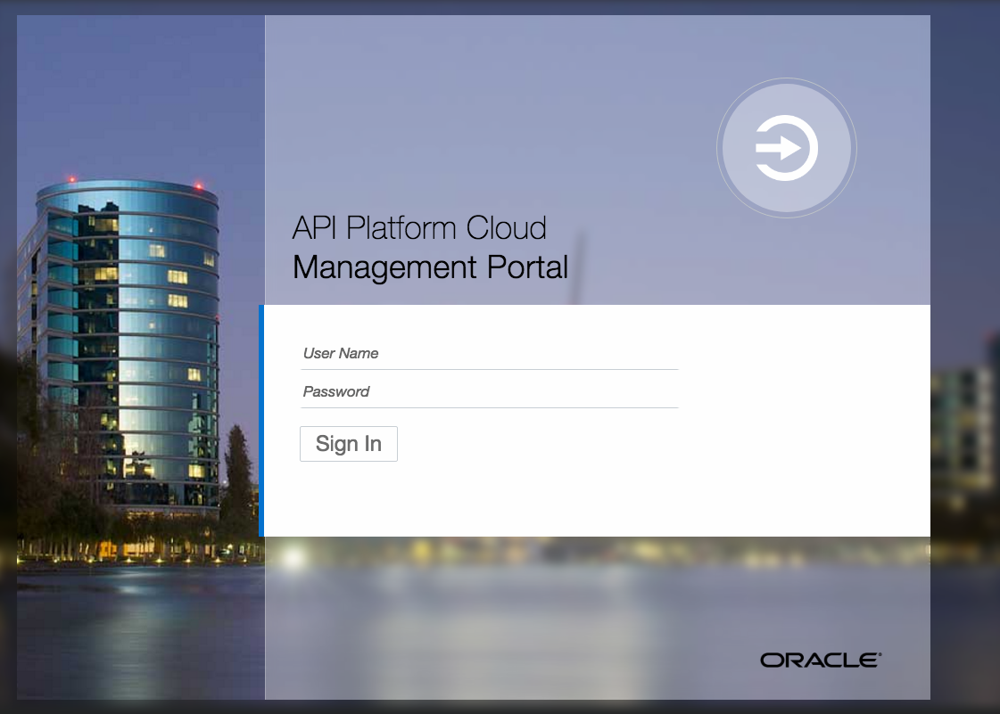  

Sign in to the Management Portal as a user with the `API Manager` role:

 

---

## 1. API Platform Cloud - API Policies
---


### 1.1 Add a Key Validation Policy

------

In this part of the lab, you’ll add a validation policy to your API to ensure that Application Developers consuming it have registered it to an application, the application is registered, and a current, valid application key is used.

To configure the key validation policy:

**1.1.1**	Back in the Management Portal, click the API Implementation tab.


**1.1.2**	In the `Available Policies` section, expand `Security`, hover over `Key Validation`, and then click `Apply`.


**1.1.3**	On the Apply Policy Dialog, complete these fields:

**1.1.3.1** (Optional) Complete the name and description fields as you would like.

**1.1.3.2** Ensure that `API Request` is selected from the Place Policy After list, and then click Next.

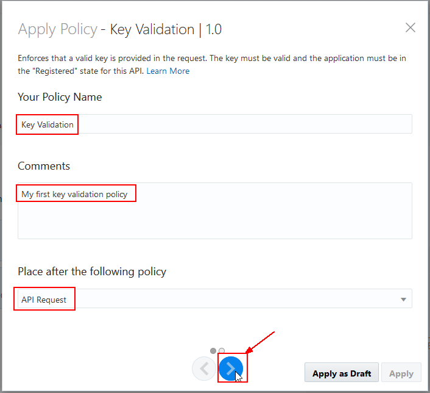

**1.1.3.3** Click the Header tab.

**1.1.3.4** Enter the text `app-key` into the Header field. The application key must be sent in a header named `app-key` for the request to be passed to the next policy or to the service request endpoint.

**1.1.3.5** Click `Apply as Draft`.  This will create the policy but it won't be deployed onto the gateway at this point.


**1.1.4**	Note that the new "Key Validation" policy will show up in the `Request` pipeline.

**1.1.5** Click the `Save Changes` button.


### 1.2 Add an Application Rate Limiting policy

------

Follow this task to add an application rate limiting policy. Application rate limiting policies are used to control how many requests are routed to an API from each application during a given period. If this threshold is exceeded, the gateway rejects subsequent requests from that application during this period.

To configure the application rate limiting policy:

**1.2.1**	(Optional) If necessary, sign back in to the API Platform Cloud Service Management Portal as your API Manager user.

**1.2.2**	(Optional) If necessary, On the APIs page, click your API to open its details page.

**1.2.3**	(Optional) If necessary, Click the Implementation tab.


**1.2.4**	In the Available Policies section, collapse `Security` (if it's still expanded), then expand the `Traffic Management` policies.

**1.2.5** Hover over `Application Rate Limiting`, and then click `Apply`.

Note: Make sure you’ve added the `Application Rate Limiting` policy, not the `API Rate Limit` policy. These policies behave differently; if you use the wrong one you may experience results different than those described in this document.


**1.2.6** On the Apply Policy Dialog, complete these fields:

**1.2.6.1** (Optional) Complete the name and description fields as you would like.

**1.2.6.2** Ensure that `Key Validation` is selected from the `Place Policy After` list.

**1.2.6.3** Click `Next`.


**1.2.6.4** Enter a number between `1` and `10` into the `Rate Limit Per Application` field. This is the number of requests that will be passed during each time interval.

**1.2.6.5** Select `Minute` from the `Time Interval` list.

You can add additional conditions. This is useful if you want to limit the number 


**1.2.7**	Note that the new "Application Rate Limiting" policy will show up in the `Request` pipeline.

**1.2.8** Click the `Save Changes` button.


### 1.3 Re-Deploy API to the API Gateway

------

After adding policies to the API, we will now re-deploy the API to API Gateway so that it can enforce them as it receives requests at the endpoint you configured in Lab 200. 

To re-deploy the API:

**1.3.1** Click the Deployments tab.


**1.3.2** Click on the header of the `Production Gateway - NA - Oracle` gateway and you will see a set of 3 buttons: `Deactivate`, `Redeploy`, and `Undeploy`.

**1.3.3** Click on the `Redeploy` button, then the `Latest Iteration` button that will appear.


**1.3.3** You will prompted at the top that you are sure you want to redeploy.  Optionally enter a comment, then select the `Yes` button.


**1.3.4** The `Redeploy Request` message will be seen, then the request is put in the `Waiting` state until the API Gateway polls the API Management Console for the change.


**1.3.5** After waiting for the API Gateway to poll the API Management Server, the API Deployment will be promoted to the `Deployed` state again.


**1.3.6** As was done in Lab 200, copy the URL that appears in the Load Balancer URL section. This is the endpoint clients use to send requests to your proxy API on the gateway. 

**1.3.7** The URL should look something like this: http://oc-129-144-152-17.compute.oraclecloud.com:9022/helloworlduser10

### 1.1.4 Re-Test the API with Policies

------

On the APIs page you have the capability to create new API, edit or look at existing APIs. Let us explore our published ICS REST Service.

  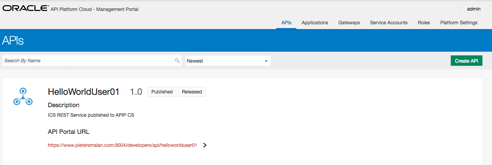

- **Click** on your `HelloWorldUserXX` API to drill down into the details

  

#### 1.1.1 API Implementation detail
---

Let's start with the implementation of our service:

- Let's confirm our `API Endpoint URL`, **click** on the `Edit` button, when hovering over the `API Request` policy box

  

- Confirm that the `API Endpoint URL` is set to `helloworlduserXX`

  

- Leaving the rest of fields on the defaults, and **click** `Apply`

- Next we are going to inspect the `Service Request`, **click** on the `Edit` button, when hovering over the `Service Request` policy box

  

  We have to specify the service account information for the call, in other words, the authentication for the ICS REST service. Select the predefined `ICS` service account and **click** `Apply`.

  

### 1.1.2 Policy Pipeline
---

#### 1.1.2.1 Key Validation

- On the right hand side, under `Available Policies`, select `Key validation 1.0` and `Apply`

  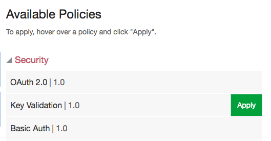

- **Click** on the `>` icon to go to the next page, we don't need any changes on this page.

  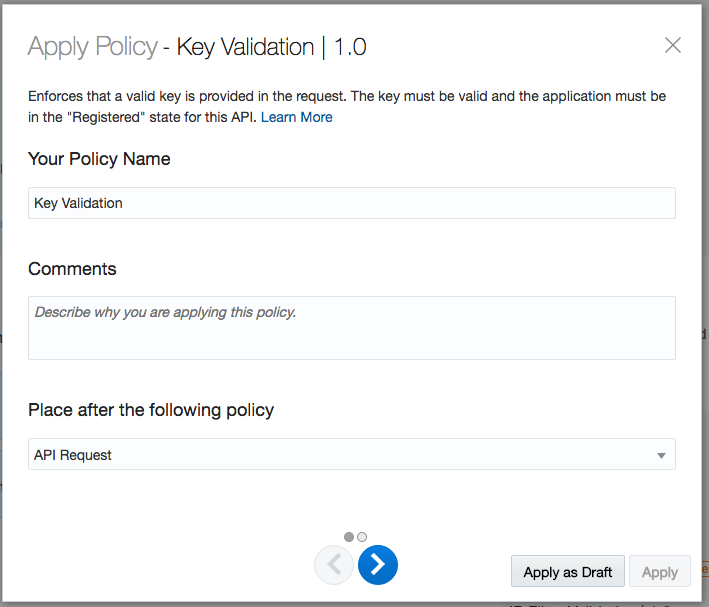

- On the second page of the `Apply Policy - Key Validation`, make sure to select the `Header` button and then specify `api-key` as the `Key Header`
  - We specified in this policy that a HTTP Header with name `api-key` should be in the request, set to a valid API Key. When we associate the API with an application, we will have    access to the api key as defined in the application.
  
  

- After **click** apply we a policy pipline as follow:

  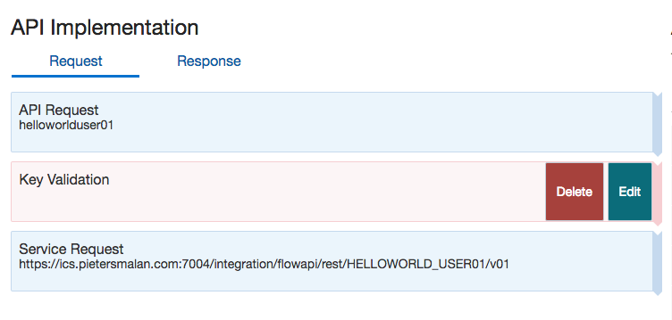

---

> Using the same steps as above, add the following policies.

---

#### 1.1.2.2 Application Rate Limiting

- Under `Available Policies` -> `Traffic Mangement` add `Application Rate Limiting | 1.0`

  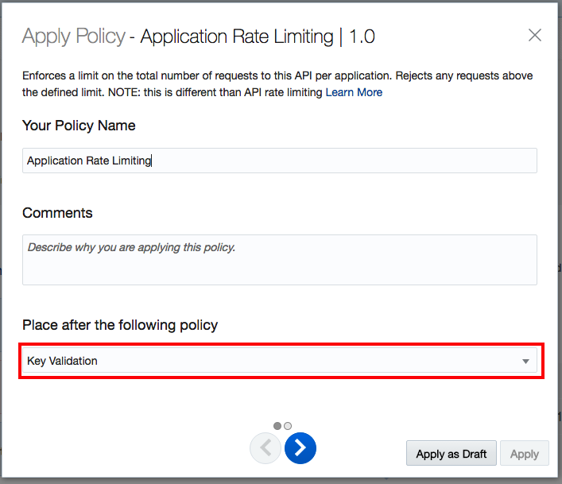

  

  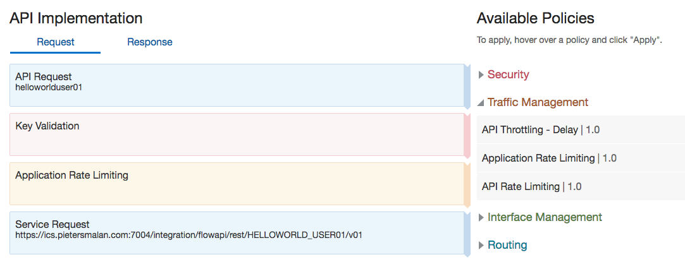

#### 1.1.2.3 Header Validation

- Under `Available Policies` -> `Interface Mangement` add `Header Validation | 1.0`

  

  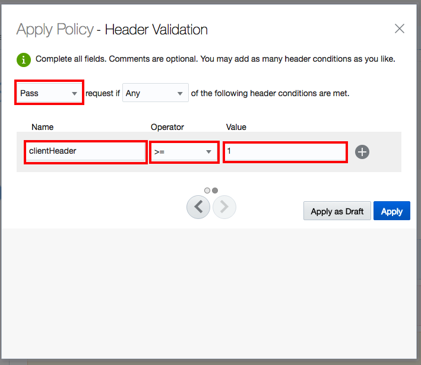

  

#### 1.1.2.4 Interface Filtering

- Under `Available Policies` -> `Interface Mangement` add `Interface Filtering | 1.0`

  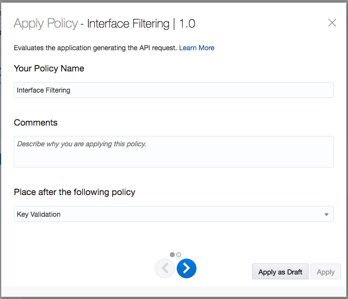

  

  

#### 1.1.2.5 Groovy Scripting

- Under `Available Policies` -> `Other` add `Groovy Script | 1.0`

  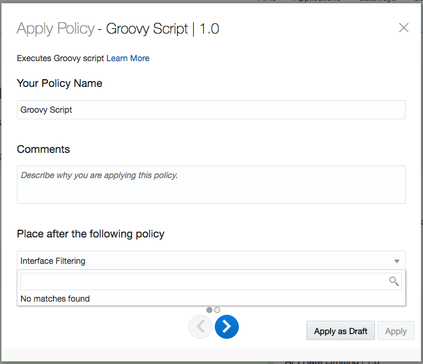

  - Add the following 3 lines in the `Groovy Script` 


  ```groovy
    def clientHeader = context.apiRequest.getHeader("clientHeader")
    def icsHeader = context.apiRequest.getHeader("clientHeader") + "-APIPCS"
    context.serviceRequest.setHeader("icsHeader", icsHeader)
  ```

  

  

----

Apply the changes, by **clicking** the `Save Changes`

  

---

### 1.3 Deployment

- The next step is to deploy the API. **Click** on the `Deployments` icon, then **click** on `Deploy API`

  

- Select the target `Development Gateway` and **click** on `Deploy`

  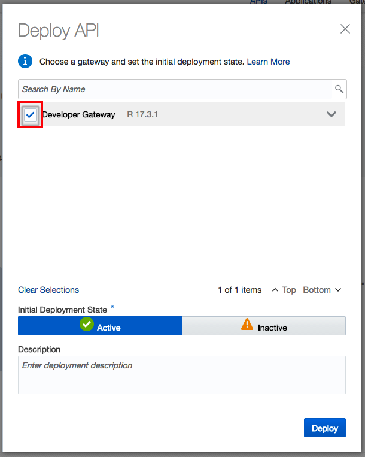

  

> It takes about a minute to deploy. Be patient.

  

  ### 1.4 Publication

  In the publication we are going to add some information for developers.

  - **Click** on the `Publish` icon

    

  - **Click** on the `Developer Portal API Overview` `Markdown` button

    Enter the following text, adopting it to your own API name:

```javascript
---
Welcome to my *Hello World API*
---
```

  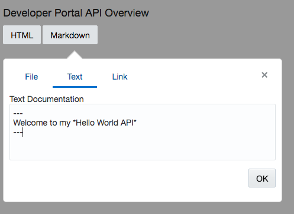

  - **Click** on `Documentation` `Markdown` and supply the following text:

``` 
This is an echo service hosted by ICS. 

The following headers are required:
---
api-key with a valid Application Key
clientHeader with an identifier (used to track flow through ICS)
---
Method: POST
---
Sample Payload:
{
  "greetings" : "Jack"
}
---
```

  

> This documentation will be replaced by the *Apiary* in a later lab

And the last steps are to `Save Changes` and then `Republish` the new documentation to the **Developer Portal** 

  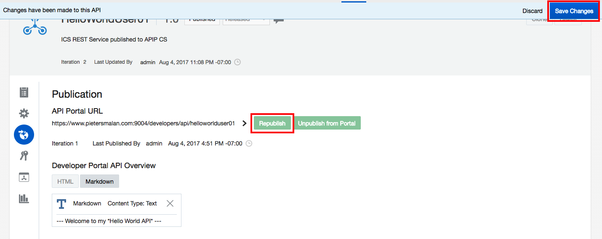

> If you are really curious to see the Developer's Portal - you can click on `Preview`, to open the developer's API Portal.

### 1.5 Registrations

Remember the test for a valid API Key ?  This is the place were we define the relationship between APIs and Applications.

- **Click** on Registrations

  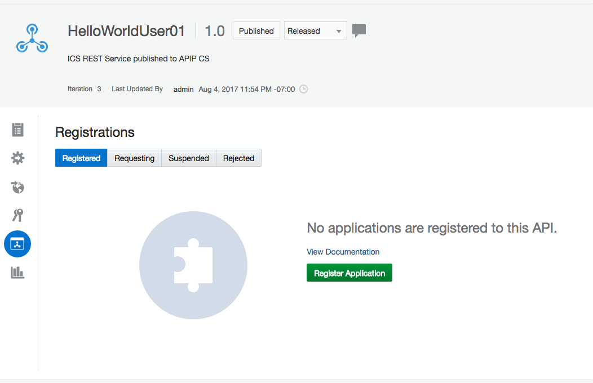

- Select `Hello World Application` and click on `Register`

  

  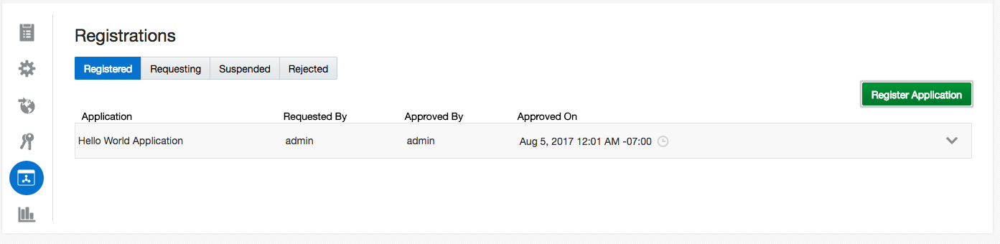

---
  ### 1.2 Applications
---

> We are not going to create applications, but we need to capture the API key.

Open the `Applications` page

  

- **Click** on the `Hello World Application`, make a note of the `App Key` (or use the `copy` icon to copy to clipboard)

  

---
  ### 1.3 Gateways
---

The `Gateways` page gives you an overview of all the registered gateways in the environment. Gateways are the entry point for your APIs, and as you can remember when we specified your `API Endpoint URL` in the API configuration, it was in the form, *http(s)://MyGatewayIP/`suppliedvalue`*. 

 

Looking at gateway where you deployed your API to and the gateway's loadbalancer, you can determine how to access the API.

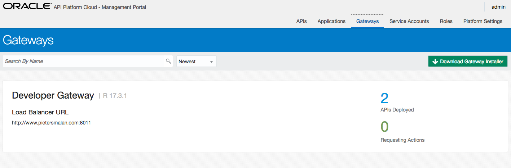


> Also note that the `Download Gateway Installer` link is on this page.


---
  ### 1.4 Service Accounts
---

---
  ## 2 Developer Portal
---

---
---
---

Testing still needs to be done  - GET failure - Key not set - move POST policy to front - only POST allowed - track under API stats

http://www.pietersmalan.com:8011/helloworlduser01/helloworld - extra helloworld for ICS resource

POSTMAN / APAIRY or Swagger (OpenAPI) to test POST rest service