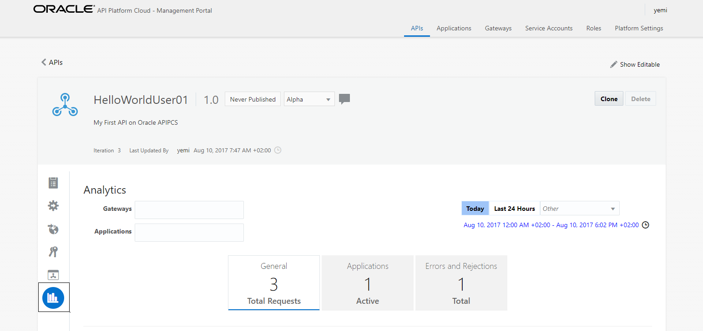
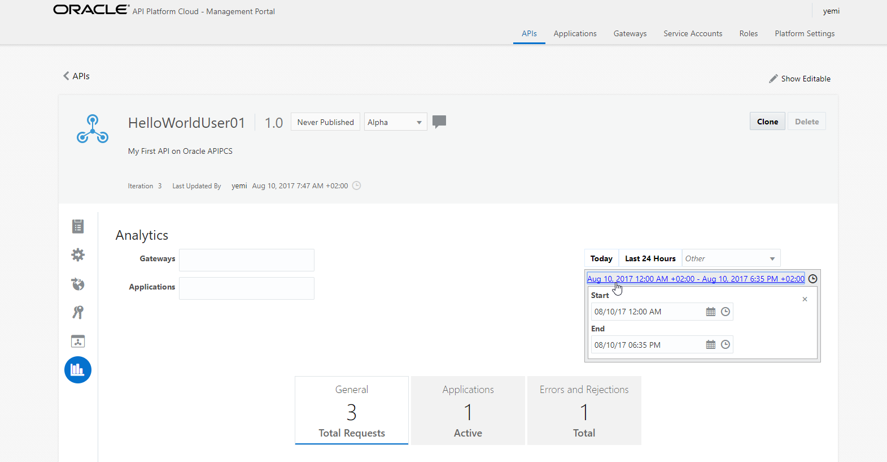
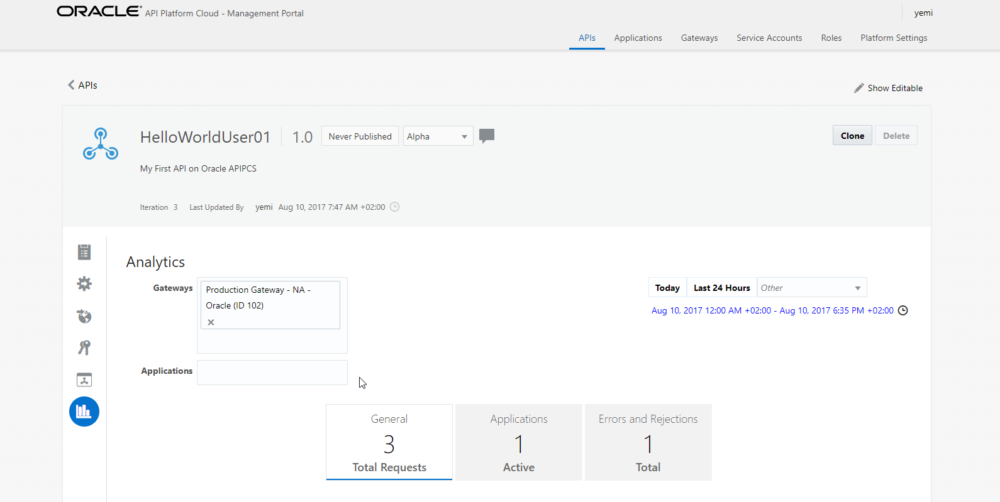
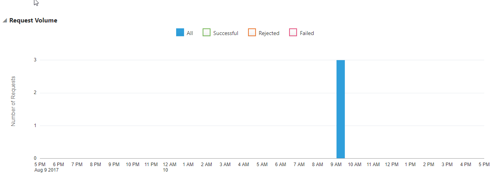
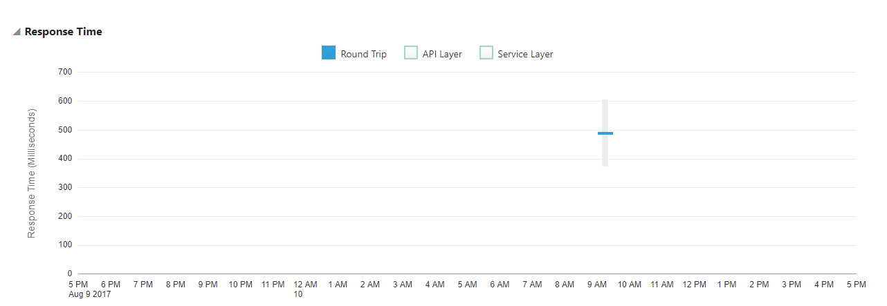
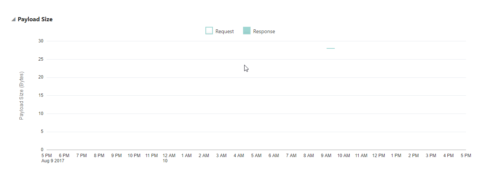
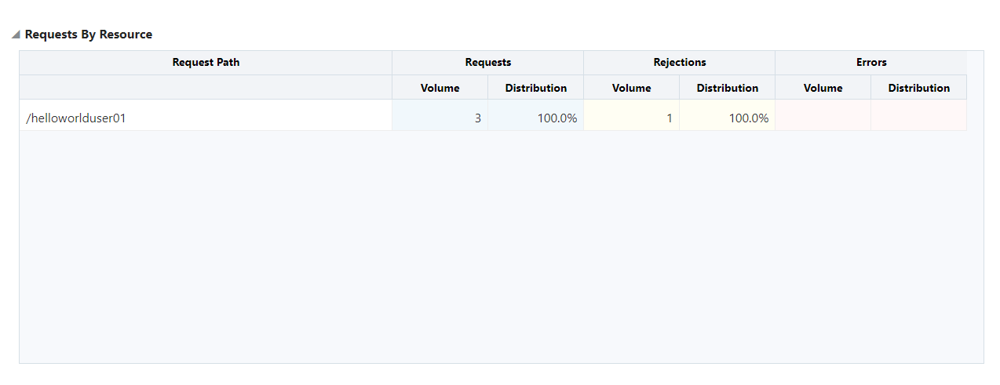

# Lab 400 - API Platform Cloud Service

---

## Objectives

- Using API Platform Cloud Service to view Analytics of API's 

## Required Artifacts

- The following lab and an Oracle Public Cloud account that will be supplied by your instructor.

## Introduction

In this Lab you’ll view five of the charts available to API Managers.

## 1.1: API Analytics

### **1.1.1**: API Analytics General Page

---

-To view analytics for your API:

-Back in the Management Portal (https://oc-129-150-76-122.compute.oraclecloud.com/apiplatform/public/login.jsp)click the Analytics tab for your API. The Analytics tab is the last on the left.

-The General page displays the Request Volume, Response Time, Payload Size, and Requests by Resource charts. The other charts are displayed on the Applications and Errors and Rejections tabs.

-The time controls on this page allow you to retrieve data for a specific period of time. By default, data from today (from 12:00AM to the current time) appears. Click Last 24 Hours to display data for a period 24 hours previous to the current time. If you want to display data for a different period, you can:

-select a pre-defined time period (current hour or week, specific month or year, last minute, hour, etc.) from the Other list, or

-click the time interval below the Other list to manually specify a start time, an end time, and a date.

-To return data for a specific gateway, enter the name(s) of the gateways to which the API is deployed. Analytics data is aggregated for all of the selected gateways; removing a gateway from this field also removes the data from the Analytics tab. You can further filter data by application. In the Applications field, you can enter the name(s) of applications registered to this API to display data for only these applications. Requests from unregistered applications are also collected; you can view data for all of these requests by selecting Unknown Applications from this list.

-Changes to any of these filters (time, gateway, or application) affects all of the data on the Analytics tab.

### **1.1.2**: Request Volume Chart

---

-The request volume chart displays how many requests an API deployed to a gateway received. For a given time, you can configure the chart to display all requests, only successful requests, only rejected requests, or only errored requests.

-The request volume chart provides a general overview of the traffic an API is receiving, how the requests are trending over time, and the overall health of the traffic in terms of rejected requests and other errors.

### **1.1.3**: Response Time Chart

---

-The response time chart displays, in milliseconds, the range of round-trip request and response times for a selected API. The ranges, represented by a gray bar, indicate the shortest and longest response times during the indicated time period. The median round-trip time is indicated by a blue bar in the range for a time period. For a given time, you can configure the charts to display the range of round-trip calls, the range of time spent in the API layer, and the range of time spent in the service layer.

-The response time chart gives API Managers an idea of the ranges and medians of response times for requests, how these trend over time, and how response times are split between the API and service layers.

### **1.1.4**: Payload Size Chart

---

-The Payload Size chart displays the size of the payloads sent with each request. You can filter this chart to display the size of request or response payloads.

-You didn’t send any requests with response payloads; click Response to view the size of response payloads sent from the backend services.

### **1.1.5**: Requests by Resource Chart

---

-The Requests by Resource chart, at the bottom of the General page, displays the number and distribution of requests to your service’s resources. For each resource, this chart displays:

- The total number of requests to each resource
- The percentage (of total requests) of requests to each resource
- The total number of policy rejections for requests to each resource
- The percentage (of total rejections) of rejected requests to each resource
- The total number of service errors for requests to each resource
- The percentage (of total errors) of errored requests to each resource

## Completion of LAB 400
